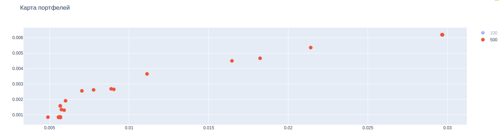
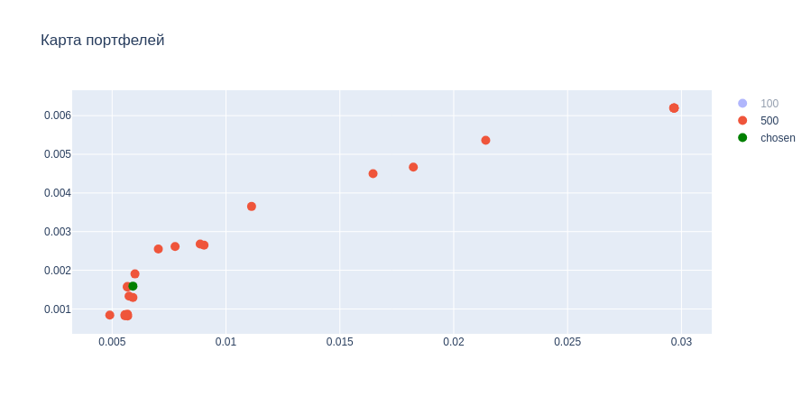
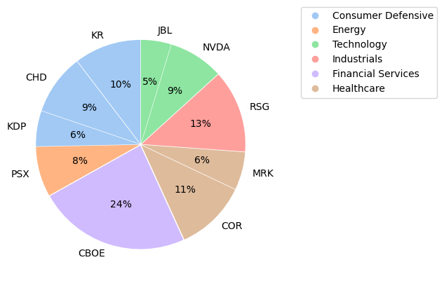
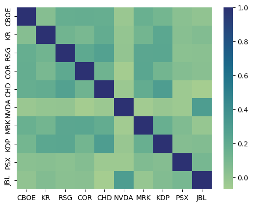

# Контест
**Выполнили:**

- Суслова В.Д. (20ПМИ-1)
- Циновник Е.В. (20ПМИ-2)

## Инвестиционный портфель на NYSE

Мы выбрали для себя следующую стратегию. 

Были собраны данные за 2023 и начало 2024 годов об акциях, которые входят в индекс S&P 500 (индекс, состоящий из 500 избранных торгуемых на фондовых биржах США публичных компаний, имеющих наибольшую капитализацию). Мы решили попробовать использовать разные методы оптимизации для сбора портфеля на все акции: sharp ratio, utility, минимизация риска и разные меры риска: стандартное отклонение, Value at Risk, Ulcer Index.

В итоге получилось несколько разных портфелей с одними акциями, но разными долями:

Их расположение можно видеть на карте. Причем самый верхний правый - это когда оптимизируется функция полезности, а крайний левый - это когда идет минимизация риска. 

Так как ситуация в мире не совсем стабильная, (хоть и рассматривается рынок отдельной страны, однако происходящие вокруг события не могут на нем не сказываться), то мы для себя решили, что главный приоритет будет в минимизации риска. 

Исходя из этого, был взят портфель, который оптимизировался с помощью функции полезности, но с достаточным параметром "неприятия риска". В итоге портфель занял следующее место на карте активов:

В него попали следующие акции с долями:

| Актив   |   Вес     |
|:--------|----------:|
| CBOE    | 0.236767  |
| KR      | 0.103671  |
| RSG     | 0.128881  |
| COR     | 0.111503  |
| CHD     | 0.0942578 |
| NVDA    | 0.0854426 |
| MRK     | 0.0589322 |
| KDP     | 0.0552147 |
| PSX     | 0.0781534 |
| JBL     | 0.0471769 |

А итоговые характеристики такие:

- Риск: 0.0059
- Ожидаемая доходность: 0.0016

Немного посмотрим, что из себя представляют активы.

Можно заметить, что у нас нет преобладания какого-то конкретного сектора, что неплохо, ибо значит, что наш портфель диверсифицирован.

Посмотрим на возможную корреляцию. Можно снова заметить наибольшую корреляцию у активов из одного сектора, но в остальном она не такая сильная. 