# Домашняя работа №1
**Выполнили:**

- Суслова В.Д. (20ПМИ-1)
- Циновник Е.В. (20ПМИ-2)

## Анализ Российской биржи за 2018 год
Данные были собраны с сайта MOEX. Также они были обработаны:

1. Удалены пропуски
2. Убраны акции, которые практически не торговались (NUMTRADES = 0)

В итоге получилось 168 акций, где у каждой есть 254 наблюдения. 

Посчитаем у каждой акции сколько дней ее доходность была равна нулю. Наибольшее кол-во таких дней у следующих акций:

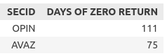

- OPIN - ПАО «Инград» — инвестиционно-девелоперский холдинг.
В 2017 году ООО «Концерн „Россиум“» объявил об объединении девелоперских компаний ПАО «Опин» и АО «Инград» в единую компанию ПАО «Инград», что видимо сказалось на акциях в 2018 году. 
- AVAZ - "АвтоВАЗ" в 2018 году производила делистинг акций с МосБиржи, из-за чего, как я понимаю, производилась некоторая регулировка цены для держателей акций.

Также если мы рассмотрим, сколько дней у каждой акции объем продаж был нуль, то мы снова увидим в топе АвтоВАЗ:

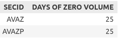

По итогу общая карта активов получилась такая:

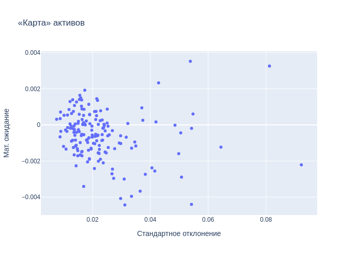

Средняя доходность большей части активов колеблется в пределах от -0.002 до 0.002, риск - от 0.01 до 0.025. Тем не менее, достаточно много активов обладают высоким риском при невысокой доходности (но есть исключения). Больше половины акций обладают отрицательной доходностью.

Посмотрим на некоторые компании с высоким риском и высокой доходностью:

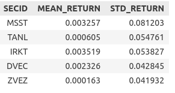

- IRKT - ПАО "Яковлев", производство гражданских самолетов
- MSST - ОАО "Мультсистема", коммунальные услуги
- DVEC - ПАО "Дальневосточная энергетическая компания", энергетическая сбытовая компания

Компании с высоким риском и низкой (отрицательной) доходностью:

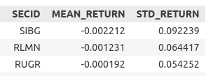

- SIBG - ПАО «Айс стим Рус», продукты сублимационной сушки и пищевых компонентов
- RLMN - ПАО «Группа Компаний „Роллман“», химикаты
- RUGR - "РУСГРЭЙН ХОЛДИНГ", еда и табачные изделия

---
**Мини-вывод:**

Нужно не только следить за ценами акций, но и за тем, что происходит с компаниями. Потому что они могут начать объединяться с другими или уходить с биржи, что сильно повлияет на акции. 

А еще просматривается, что в России в 2018 году были тенденции к падению доходности акций.

----

### Теперь рассмотрим портфель с равными долями и индекс биржи:

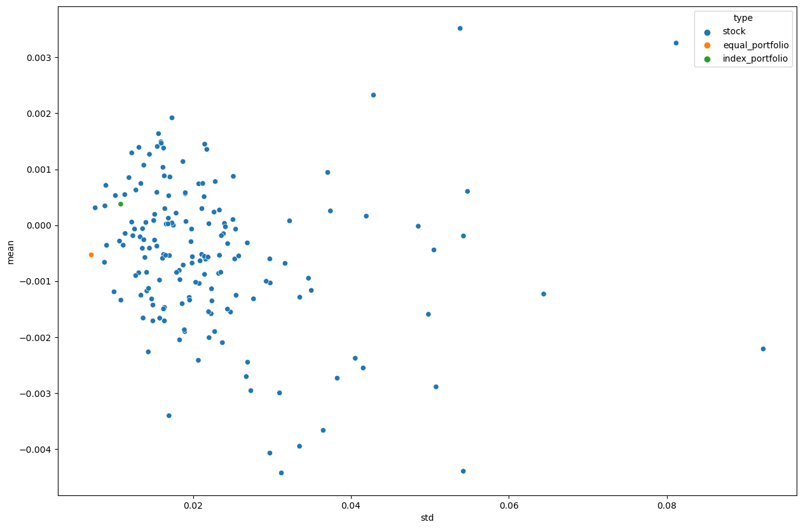

| Портфель | Ожидаемая доходность | Риск |
|:---------|---------------------:|-----:|
|Индекс    |0.000377|0.01|
|Равные доли|-0.00053|0.007|

Видно, что индекс расположен все-таки дальше портфеля с равными долями. И первая мысль, что данный индекс состоит из достаточно доходных акций. И это так и есть. В 2018 год в индекс входили Газпром (14,99%), Лукойл (13,93%), Сбербанк (14,88%).

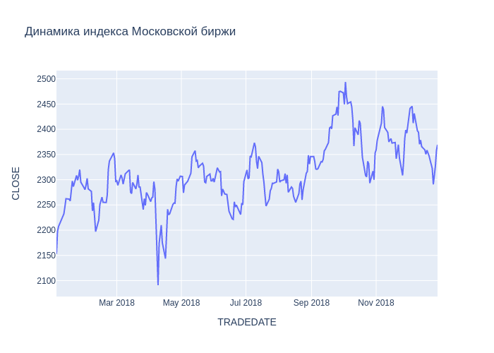

В целом индекс показывает положительную динамику. В апреле наблюдаем резкое падение мндекса - повлияло ожесточение санкций США. Осенью индекс стал расти из-за повышения цен на нефть, соответсвенно стали расти акций "Газпрома", "Лукойла", "Роснефти" и других связанных с нефтью компаний. 

Еще мы немного поигрались с долями в портфели, состоящим из всех акций. Для распределение долей мы использовали распределение Дирихле, потому что сумма всех долей должна быть равна 1. Один из результатов был такой:

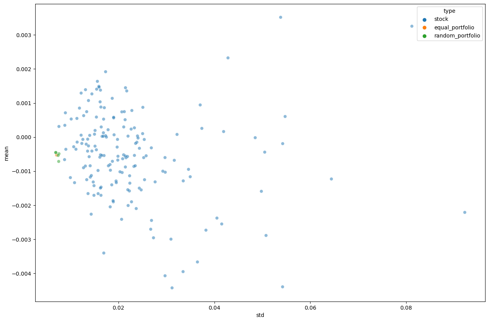

В основном рандомные портфели концентрируются вокруг портфеля с равными долями. Однако в какой-то момент получился достаточно интересный портфель, который имеет меньший риск и более высокую доходность.

### Теперь рассмотрим VaR.

Актив с самой большой возможной потерей: 
- SIBG - ПАО «Айс стим Рус», продукты сублимационной сушки и пищевых компонентов.

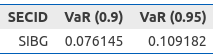

Актив с наименьшей возможной потерей:

- VSMO - ПАО "Корпорация ВСМПО-АВИСМА" - российская металлургическая компания, производящая титан и изделия из него.

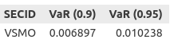

Можно посмотреть на распределение потерь обоих компаний. 

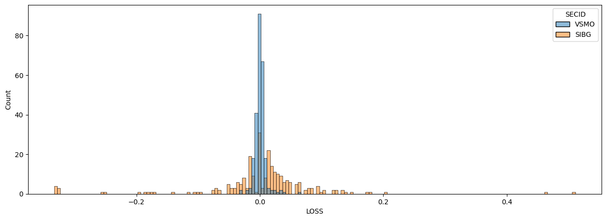

Металлургическая компания тут выглядит более выиграшной, потому что у нее более выраженная пика в нуле + SIBG имеет тяжелые хвосты.

На карте активов суждение, что VSMO (зеленое) более надежно, только подтверждается, т.к. ее риск даже меньше риска индекса биржи: 

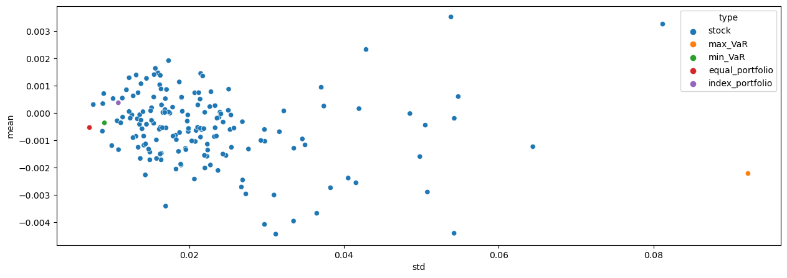

А что касается портфеля с равными долями, то у него следующие показатели:

- VaR (γ = 0.90): 0.000013
- VaR (γ = 0.95): 0.000017

Так что с таким портфелем можно не особо волноваться о потерях.

### Посмотрим несколько значимых активов рынка.

Отбор шел по тому, у кого самая высокая медиана объема продаж, т.к. с нашей стороны предпологается, что такие акции лучше показывают движение рынка (более ликвидны). В лидерах оказались:

- VTBR - ВТБ банк (входит в индекс биржи на 2,46%)
- TGKA - ПАО "ТГК-1" - российская энергетическая компания, созданная в результате реформы РАО «ЕЭС России».
- FEES - ПАО "Россети" - российская энергетическая компани (входит в индекс биржи на 0,39%)
- HYDR - ПАО "РусГидро" - российская энергетическая компания, владелец большинства гидроэлектростанций страны, одна из крупнейших российских генерирующих компаний по установленной мощности станций и третья в мире гидрогенерирующая компания. (входит в индекс биржи на 0,77%)
- TGKB - ПАО "ТГК-2"

Можно подметить, что большинство компаний с большим объемом - это энергетические компании. И такие компании зачастую входят в индекс биржи.

Что же происходит с этими акциями в 2018 году? В основном они показывают отрицательную доходность. Чтобы подтвердить свои слова я сгруппировала акции по месяцам и нашла сумму дневных доходностей за месяц (мы имеем право это сделать, т.к. наша доходность логорифмическая). Получилась вот такая картина:

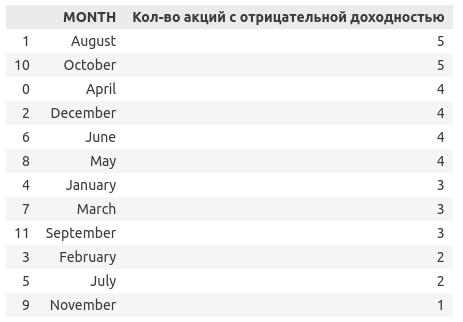

Самый неудачный месяц для всех оказался Август и Октябрь.

Однако если посмотреть по отдельности, то можно увидеть, как в Апреле начала падать доходность (возможно как раз из-за санкций). И особенно сильно досталось TGKB.

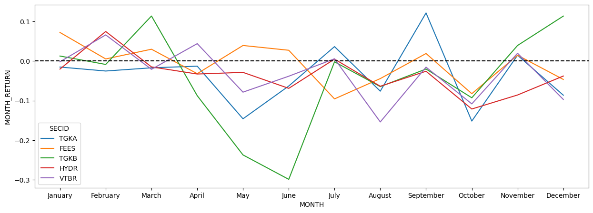

Если смотреть по дням, то можно увидеть просадку 4 апреля:

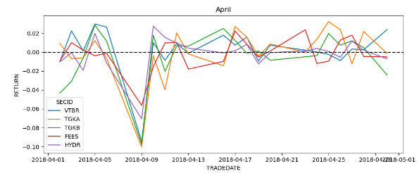

Что касается гипотезы о случайности, то для нее использовался тест инверсий, и он показал следующее: 

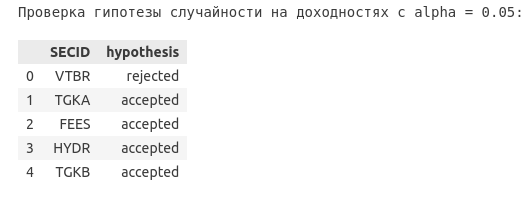

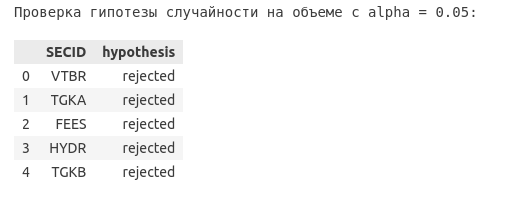

Т.е. на доходностях сомнение, что данные принадлежат случайному распределению, вызывают только акции ВТБ банка.

Возможно это связано с "повторением пик" доходностей:

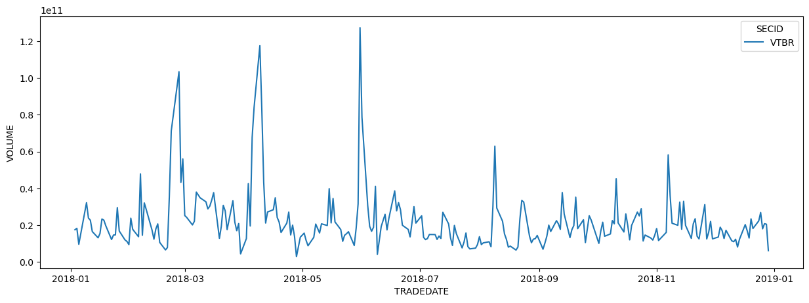

А вот на объеме все гипотезы были опровергнуты. 

Тест тренда Манна-Кендалла же показал, что только доходность ВТБ банка имеет убывающий тренд (наблюдения за год): 

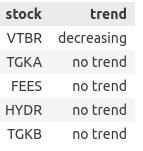

А вот объем убывает у большинства акций: 

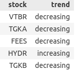

И если провести тест на каждом месяце, то можно снова убедиться, что летние месяцы были не самыми удачными:

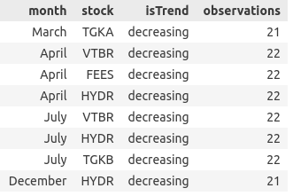

### Теперь рассмотрим разные производственные сектора.  

Выберем компании, которые входят в индекс голубых фишек МосБиржи на 2018 (индекс рассчитывается на основании цен сделок с акциями 15-ти наиболее ликвидных акций российского фондового рынка или так называемых "голубых фишек"):

- GAZP - ПАО "Газпром", Энергетические и минеральные ресурсы
- SBER - ПАО "СберБанк России", финансы, банки
- GMKN - ПАО ГМК "Норильский Никель", Несырьевые полезные ископаемые
- MGNT - ПАО "Магнит", розничная торговля, продуктовая розница
- IRAO - ПАО Интер РАО ЕЭС, коммунальные услуги, электроэнергетика
- YNDX - Yandex NV, технологии, интернет-сервисы и ПО

Сначала построим гистограммы распределения доходностей и объёмов продаж:

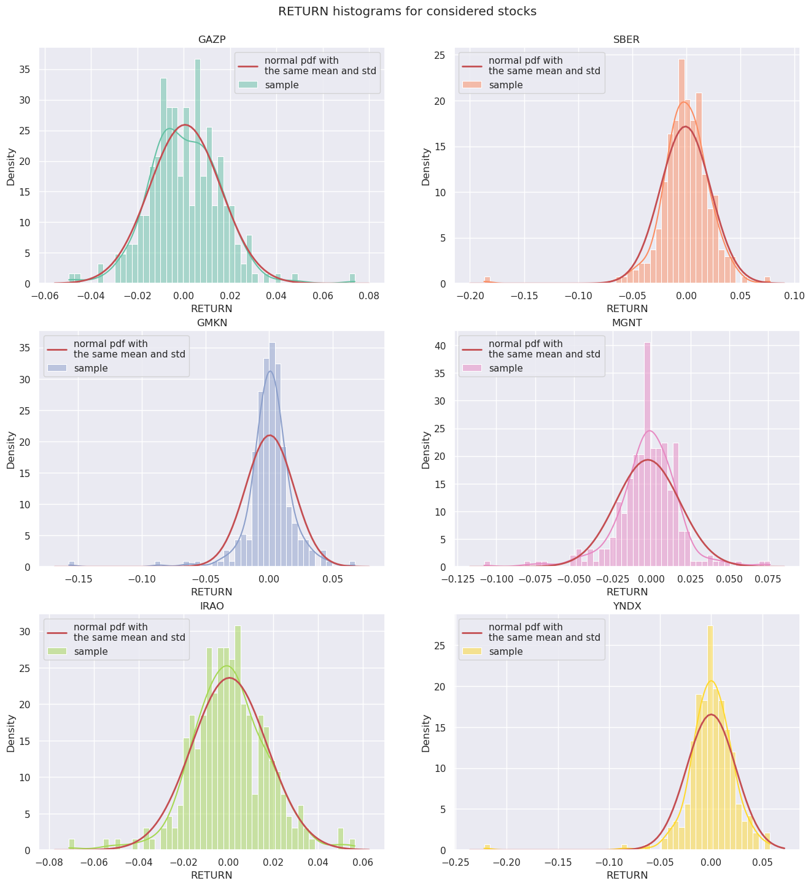

На графиках красным цветом построена функция плотности нормального распределения с средним и стандартным отклонением, вычисленными по выборке логарифмической доходности или объёма продаж для каждой акции. Гистограммы объёмов продаж однозначно не похожи на нормальное распределение,  а по гистограммам лог.доходности не можем утверждать точно (распределение колоколообразно, но относительно далеко от настоящего нормального с теми же параметрами).

Попробуем другой графический метод проверки на нормальность: Q-Q plot. 

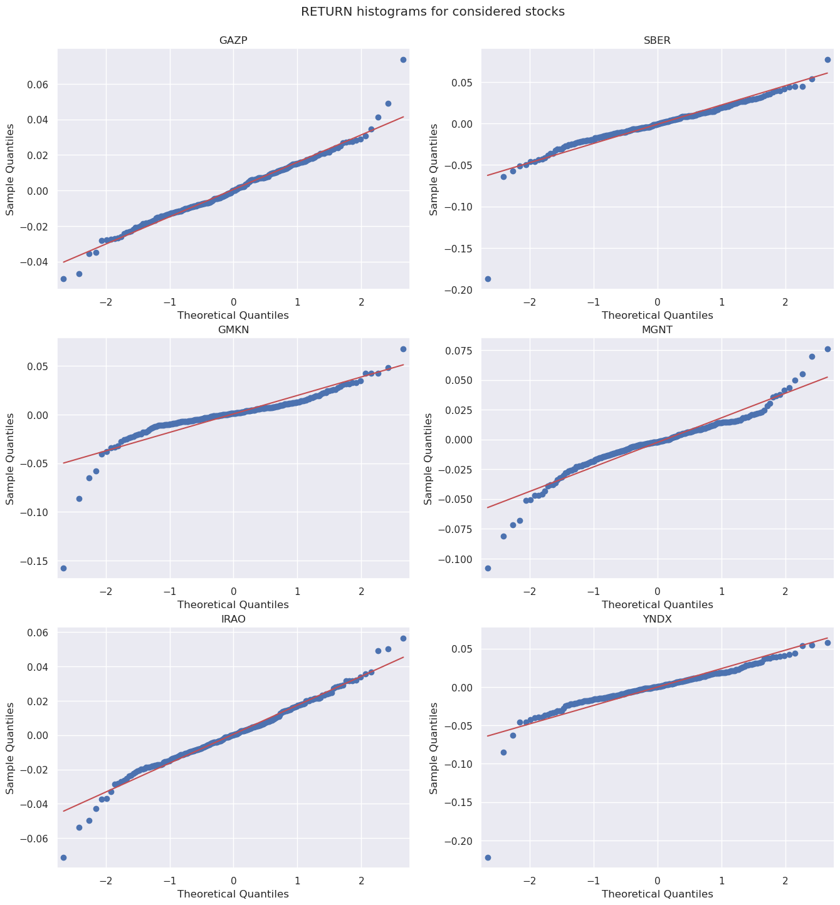

Q-Q plots для акций GAZP, SBER, IRAO показывают, что распределение доходностей этих акций близко к нормальному распределению (мешают "хвосты"). Квантиль-квантиль графики для других акций показывают, что распределение далеко от нормального (не соответствует линии главного тренда). Насчет распределений объемов продаж можем утверждать, что они имеют не нормальное распределение для всех рассматриваемых акций. 

В результате проверки на статистических тестах, тесты Колмогорова-Смиронова и Андерсона-Дарлинга не отвергают гипотезу о нормальности распределения доходностей "Газпрома" GAZP, 
тесты Колмогорова-Смиронова не отвергают гипотезу о нормальности распределения доходностей "Сбера" SBER и "Интер РАО ЕЭС" IRAO, в остальных случаях гипотезы о нормальности отвергнуты.

### Проверка зависимости секторов

Для проверки зависимостей между секторами были выбраны нефтегазовые отрасли: 

- LKOH - Лукойл 
- TRNFP - Транснефть
- TATNP - Татнефть
- ROSN - Роснефть
- NVTK - Новатэк

И строительные:

- LSRG - ПАО "Группа ЛСР"
- PIKK - ПАО "ПИК СЗ"

Гипотезы однородности в каждом секторе между акциями были приняты. И только между разными секторами отвергнуты: 

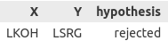

Еще была рассмотрена корреляция Кендалла между всеми акциями: 

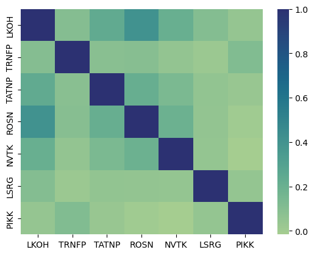

Клетки квадрата, который ограничивает нефтегазовые акции (LKOH -> NVTK), будут немного потемнее, что говорит о более сильной корреляции между акциями одного сектора, чем разных. Особенно сильная корреляция у Лукойла и Роснефти. 

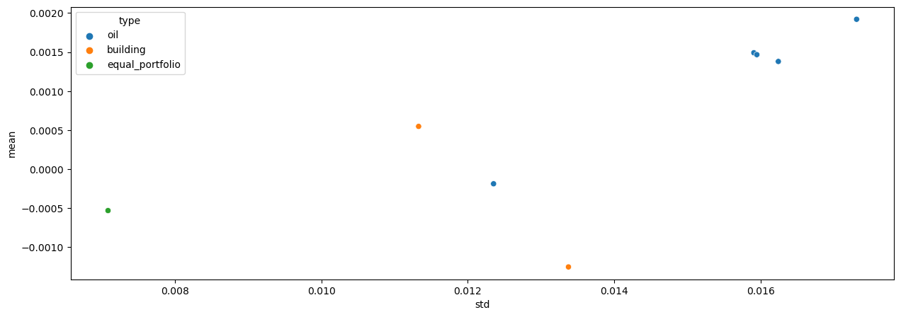

В целом акции нефтегазовых компаний обычно группируются вместе, имея больший риск, но и большую доходность.

# Вывод

Российский рынок акций в 2018 году показывал тенденции к падению доходностей акций (в частности летом), однако в конце года были видны подвижки к повышению. 

На графиках можно было видеть, как многие активы имеют не только малую доходность, а в большинстве случаев отрицательную. Еще были сильные перепады цен во время введения санкций США и подъеме цен на нефть. 

В таких ситуациях лучше **не** действовать с горяча (сразу продавать акции во время падения). А кому-то предприимчивому можно даже закупить акции на падении, чтобы выиграть при росте. А если хочется зеленых показателей в своих портфелях и больше стабильности на российской бирже, то тогда желательно включить туда акции нефтегазовых компаний. (Не является инвестиционной рекомендацией)
