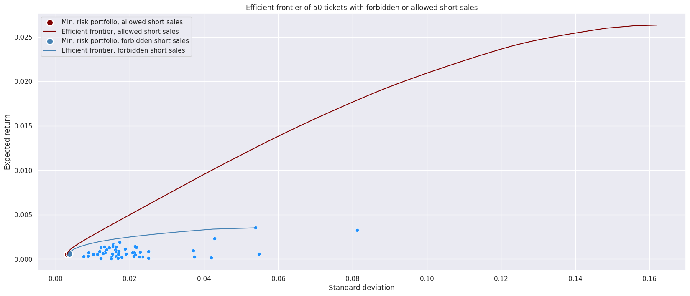

# Домашняя работа №2
**Выполнили:**

- Суслова В.Д. (20ПМИ-1)
- Циновник Е.В. (20ПМИ-2)

## 1. Оптимальные портфели

Выберем 50 акций, которые имеют наибольший объем, а значит они имеют наибольшую ликвидность. Предпологается, что такие акции будут интереснее для наблюдений.

Сгенерируем несколько рандомных портфелей с запретом на короткие продажи и разрешением. 
Сразу на первом графике можно увидеть, как портфели с короткими продажами рисковые, но имеют большую доходность. 

В особенности можно заметить, что доходность портфелей с короткими продажами **в основном** - положительная. Хотя с запретом коротких продаж ближе к 0 и меньше. Скорее всего такое резкое отличие как раз в том, что на Российском рынке в 2018 году было много портфелей с отрицательной доходностью, и соответсвенно вести короткие продажи отчасти выгодно.

Что касается портфеля с равными долями, то он занимает некую среднюю позицию, что не так интересно. Вот индекс рынка явно близок к эффективному фронту при запрете коротких продаж. 

### 2. Portfolio selection problem

Теперь выберем 50 активов по-другому: будем основываться на максимизации платы за риск, или коэффициента Шарпа с безрисковым активом с нулевой доходностью. Топ-10 активов, очевидно, располагаются выше остальных активов с тем же риска:

**Эффективный фронт на 10 активах, разрешение / запрет коротких продаж**

Построим эффективный фронт на выбранных 10 активах с разрешением и запретом коротких продаж.

Эффективный фронт с запретом коротких продаж совпадает на начальном фрагменте с эффективным фронтом с разрешенными продажами (редкий случай), затем находится ниже (как и должно быть). В случае с запрещёнными короткими продажами линия фронта ограничена, так как невозможно получить доходность портфеля выше максимальной доходности актива. Фронт с разрешением не ограничен. Можно сделать вывод, что эффективные фронты построены верно.

**Эффективный фронт на 50 активах, разрешение / запрет коротких продаж**

Теперь построим эффективный фронт на выбранных 50 активах с разрешением и запретом коротких продаж.

Как и в предыдущем случае, эффективные фронты верно найдены: с запрещенными продажами находится ниже и ограничен. 

**Сравнение**

Построим на одном графике все четыре эффективных фронта. Линия на 50 активах значительно более резкая по сравнению с остальными, с возрастанием риска доход растет сильнее, чем в других случаях.

Посмотрим поближе на остальные фронты, сравним с Индексом Московской биржи. Видно, что даже портфели с минимальным риском имеют более высокую доходность,чем индекс. В целом, эффективные фронты на 10 активах отлично себя показывают: эффективный фронт с запрещенными короткими продажами частично совпадает с фронтом с разрешенными. К тому же, фронт с разрешенными короткими продажами даже пересекает и частично превосходит фронт без коротких продаж на 50 активах,
то есть фронты на 10 занимают максимально выгодную позицию из возможных. Несмотря на это, позиции фронтов на 50 также достаточно выгодны, особенно с разрешенными короткими продажами. Поэтому можно сделать вывод, что способ выбора активов в портфель с помощью платы за риск стоит внимания.

### 3. Risk aversion

**Запрет коротких продаж**

Было рассмотрено несколько параметров risk_aversion (10, 4, 2, 1, 0.5). И в целом видно, что оптимальные портфели распологаются выше рандомных и даже получились повыше индекса рынка. Но интересно, пожалуй то, что разница в доходе между оптимальным портфелем с меньшим риском и наибольшим - маленькая. Так что я бы даже, наверное, советовала выбирать как раз самый левый оптимальный портфель.

Всего акций было 50, однако в полученном ответе на самом деле основные доли забирают данные акции. Остальные имеют очень маленькую долю близкую к нулю. 

И соответсвенно, сразу видно, что опять на российском рынке вперед вырываются энергетические компании.

**Возможные потери** при запрете коротких продаж: 0.00002

**Разрешение коротких продаж**

С короткими продажами получается вообще вот такая ситуация. Рандомные портфели, конечно же, лежат ниже эффективного фронта. Но вот это смещение рандомных портфелей вправо от эффективного фронта все-таки интересно. Как по мне, это говорит о том, что наугад с короткими продажами лучше не играть. Однако, если вы умеете, то это очень хорошо повышает доход и уменьшает риски (но это если уметь).

**Возможные потери** при разрешении коротких продаж: 0.00009

А тут можно посмотреть, в какие акции алгоритм предпочел вложиться...

...и какие продать:

### 4. Модель Марковица-Тобина

Был взят искусственный безрисковый портфель равный 0.

**Запрет коротких продаж**

Опять построим несколько рандомных портфелей. Конечно, наш оптимальный портфель оказался лучше (крестик) и по риску и по доходу. Его sharp ratio: 0.1815.

Можно для себя на будущее отметить, что Лукойл не получил долю при распределении:

**Возможные потери** при запрете коротких продаж: -0.000046

**Разрешение коротких продаж**

Веса:

Т.е. если при запрете коротких продаж у Лукойла доли не было, то при разрешении мы сразу это используем.  

И опять оптимальный портфель оказался лучше. Его sharp ratio примерно такое же, как и при запрете коротких продаж, т.к. на самом деле кардинальных различий в долях нет. Только засчет игры в короткую на Лукойле небольшой прирост, который можно увидеть еще в VaR. 

**Возможные потери** при разрешении коротких продаж: -0.00006

### 5. One factor model

Построили однофакторную модель с использованием Индекса Московской биржи. Найдем линейные комбинации, выражающие активы, выбранные в п. 2 Portfolio selection problem. В качестве целевой функции выбираем коэффициент Шарпа с безрисковым активом с нулевой доходностью.

Для начала проверим применимость модели к рынку. 
Посмотрим на таблицу с оценками мат.ожидания и стандартного отклонения доходности, коэффициентом Шарпа, мат.ожиданием и дисперсией шума.

Во-первых, заметим, что мат.ожидание шума на всех активах очень близко к нулю, следовательно, предположение однофакторной модели о нулевом мат.ожидании выполняется.

Во-вторых, посмотрим на матрицу корреляций шума и доходности индекса. 
Условие отсутствия попарной корреляции шумов не выполняется: большая часть корреляций относительно близки к нулю, но есть исключения (высокие корреляции у шумов активов из одного сектора - нефтегазовые компании).\
Однако выполняется условие отсутствия попарной корреляции доходности индекса (фактора) и шума. Стоит проверить модель на практике.

В результате вычисления по аналитической формуле получился рыночный портфель с такими весами. Заметим, что снова Лукойл будет заниматься. В остальным доли достаточно равномерные.

Теперь посмотрим на найденный портфель в сравнении с эффективным фронтом и рыночным портфелем Марковица. Он попал на эффективный фронт, показатели практически такие же, как у портфеля Марковица.

В общем случае аналитически нельзя получить оптимальный портфель по однофакторной модели, но в рассматриваемом случае эффективные фронты при запрете и разрешении коротких продаж практически совпадают в начале, поэтому получилось такое совпадение: для коротких продаж портфель снова попал на эффективный фронт (на самом деле, конечно, его нет на эффективном фронте с запрещёнными короткими продажами, это совпадение).

Можно сделать вывод, что несмотря на то, что однофакторная модель часто может давать далекий от реальности результат, в этом случае модель показала отличный результат.

### 6. Поиск арбитражных возможностей

Для того, чтобы выяснить возможность арбитража, составили матрицу из мат.ожиданий доходности, единиц и коэффициентов, с которыми индекс входит в линейную комбинацию.

Чтобы проверить арбитражные возможности, нужно найти ранг этой матрицы. Он равен 3, что соответствует наличию арбитража. Однако, если посчитаем сингулярные числа матрицы, то увидим, что третье значение близко к нулю, что означает слабый арбитраж.

3.815917010375182 \
0.7022009139506368 \
0.0006530945141552352

Попробуем построить арбитражный портфель. Для этого построим матрицу доходностей портфелей из двух активов с нулевым риском. 

В матрице довольно много близких друг к другу значений, но есть отличающиеся.Минимальная доходность получилась у портфеля, состоящего из активов NVTK и TATN, максимальная - у портфеля из NVTK и ROSN. Попробуем решить задачу оптимизации на этих активах и найти портфель, у которого сумма долей этих активов будет 0 и скалярное произведение долей и коэффициентов $\beta$ также 0 (занулим доходности фактора в итоговом портфеле, чтобы он был константным).

Получился портфель с такими весами:

Веса маленькие, но их увеличение приведет к увеличению риска, т.е. портфель тогда будет не арбитражный.

Доходность получившегося портфеля: 7.683342455988331e-08.

Получился портфель с положительной, но очень маленькой доходностью. Можно сделать вывод, что арбитражные возможности на рынке из выбранных 10 активов есть, но доходность будет очень маленькая (на что ранее указывало близкое к нулю третье сингулярное число).
